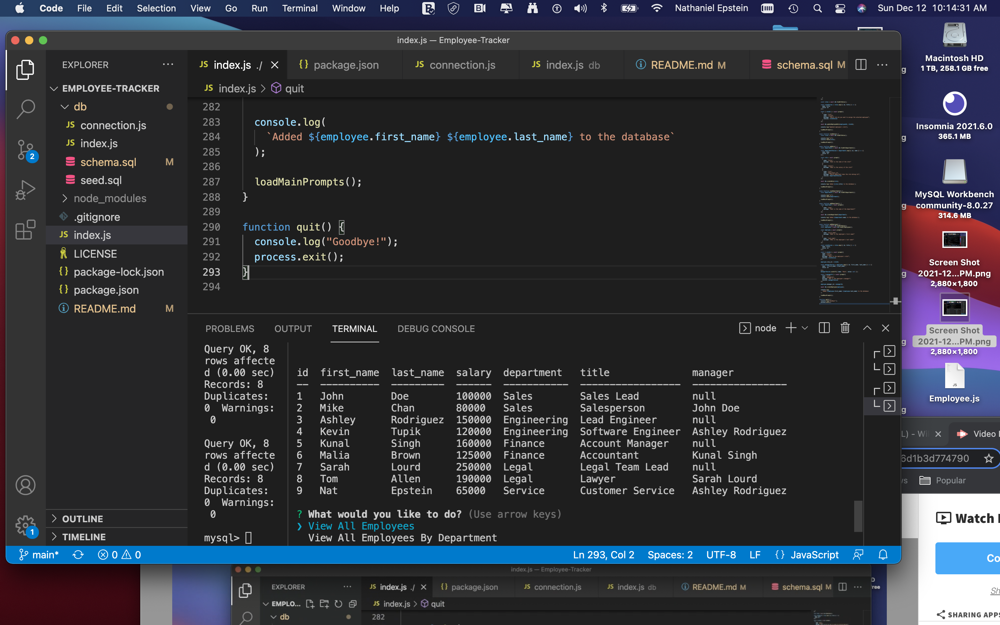

# Employee-Tracker

  
  ## Description 
  Users can easily maintain and add and update to a database using a simple command line interface. The user can look up their company's employees, which department each employee belongs to, who their managers are, what each employee's salary is and what each employee's role is and what each department's budget is. Additionally, the user can update current employees and create new employees, roles and departments.

  ## Table of Contents
  * [Installation](#installation)
  * [Usage](#usage)
  * [Tests](#tests)
  * [License](#license)
  * [Bugs](#bugs)
  * [Questions](#questions)
  * [Media](#media)

  
  ## Installation 
  The user must first install node. After that the user will need to install the following programs: asciiart-logo (this allows the terminal to display some fun text art before prompting the user for choices), console.table (which allows the terminal to display tables, much like how it would appear in mysql), inquirer (an npm that prompts users with choices) and mysql and mysql2 which allows the user to maintain the employees database and add more information as needed.
  ## Usage 
  You will need to run npm init -y and npm i asciiart-log, npm i console.table, npm i mysql, npm mysql2, npm i inquirer.
  ## Tests
  N/A
  ## License 
  This project is license under MIT License
  ## Bugs
  N/A

  ## Questions
  If you have any questions about this projects, please contact me directly at nathaniel.epstein@gmail.com. You can view more of my projects at https://github.com/natpitt2393.

  ## Media
  
  
  